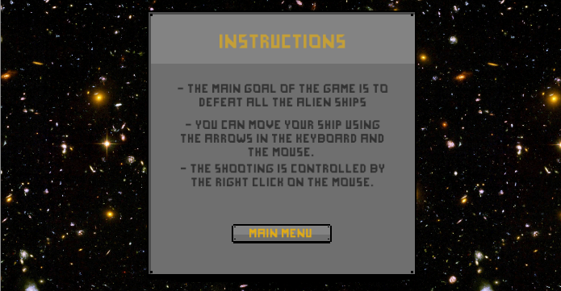
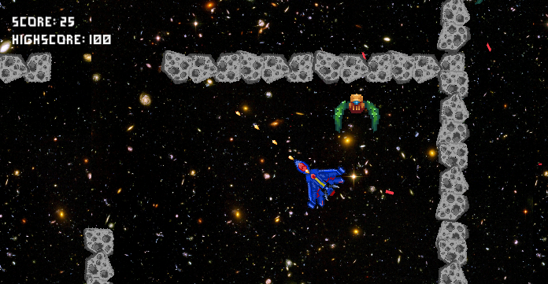

# Space Blast!

A 2D shooter game developed in Unity as part of the course **Game Design and Development 1: 2D Shooter** from the **Game Design and Development with Unity Specialization** (Michigan State University, Coursera) using assets from the MSU.

To play, download and extract the ZIP file for your platform. The executable files for each platform will be available in the Releases section of this repository.

  
  

